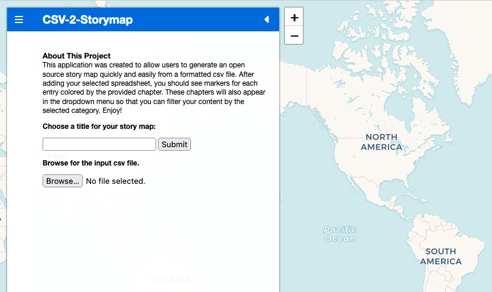
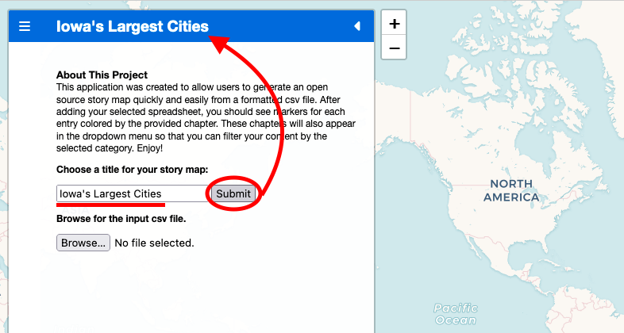
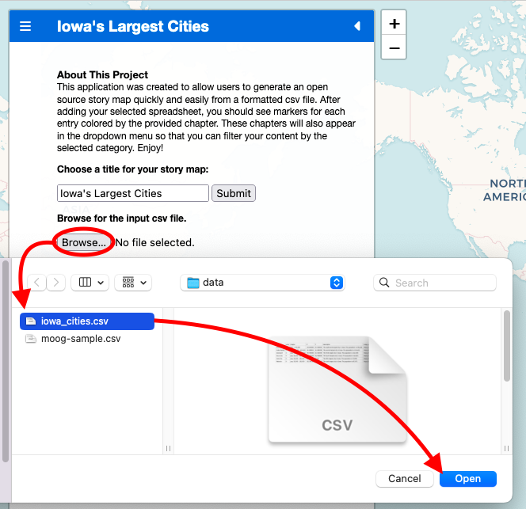
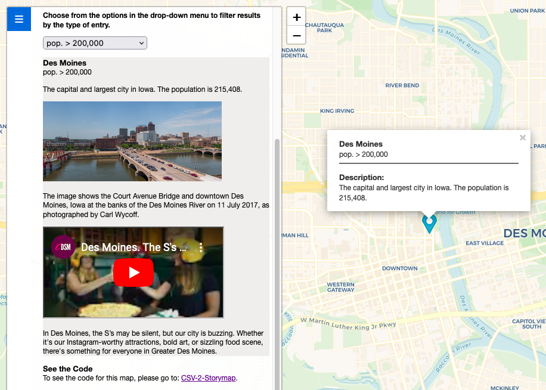
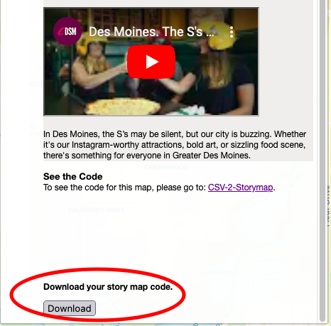
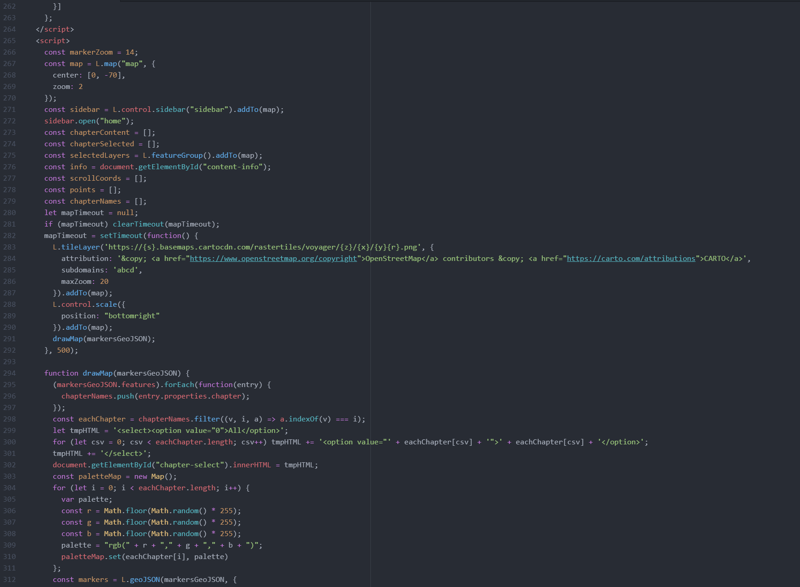

# CSV-2-Storymap (A Work in Progress)
This is a web map application that turns a template csv spreadsheet into an open source downloadable story map - see an output sample [here](https://jebowe3.github.io/CSV-2-Storymap/sample/sample-map.html). Each entry in your spreadsheet will be displayed as a clickable marker with popup content on the map. The map will also display descriptive content and image, video, and audio content in a sidebar, which will move to each relevant marker as you scroll. To try it out, click on the link [here](https://jebowe3.github.io/CSV-2-Storymap/).

# Instructions
To use this application, you will need to format your input csv file. It will be easiest to use spreadsheet software like Excel for this step. You can start from scratch, or use one of the sample spreadsheets in this repository for guidance.

## 1. Add Column Headers
First, you will need to add columns. These columns will need to be named exactly as shown below with the following headers: name, order, chapter, X, Y, description, image_url, image_description, video_url, video_description, audio_url, audio_description.

**Figure 01**. Required Column Header Names.

### A.) Name - Required
The "name" column will contain the name you want to give each point. This will appear at the top of your popup content and add the top of each entry in the scrolling sidebar.

### B.) Order - Required
The "order" column is a way to keep track of the intended sequence of your data. Number this starting with 1.

### C.) Chapter - Required
The "chapter" column will hold the theme titles for your data. This will help you to organize your data into thematic classes. For example, you may have a map of local businesses. Using this column, you could identify some as restaurants, banks, bookstores, medical practices, grocers, et cetera. The entries in this column will be used to color code your markers and to provide dropdown filtration of your markers within the sidebar.

### D.) X, Y - Required
The "X" and "Y" columns (capitalized) are used to hold the coordinate data for each point. "X" is the column for longitude in decimal degrees and "Y" is the column for latitude in decimal degrees. There are many ways to obtain this information. If you are experienced with GIS software, you can get this using a [geocoder](https://guides.library.ucsc.edu/DS/Resources/QGIS). This is the fastest and most automated method for identifying the coordinates of many points. Or, if you are familiar with Google Maps, you can click on the map window in your chosen spot to see its coordinates in decimal degrees.

**Figure 02**. Coordinates Returned by Google Maps.

In the image above, the first value (41.95650) is the latitude or Y value. The second (-91.72583) is the longitude or X value. Using at least five decimal places for your coordinate values will ensure sufficient locational accuracy.

### E.) Description - Required
The "description" column holds the primary descriptive content, which will appear in the popup and the sidebar. You may write anything you want here to help the user understand the significance of each marker.

### F. Remaining Columns
The remaining columns (image_url, image_description, video_url, video_description, audio_url, audio_description) are not required, but are intended to allow you to add media and additional descriptions as needed. You may add image links, video links to sources in mp4 format or from YouTube, and audio links to sources in mp3 format. While you can link directly to a source on the web, it might be a good idea to gather these files in your repository and link to them there so that these links do not die at some point in the future within your map application. You will also notice that each media format has a corresponding column for additional description. While these are also optional, they are added in case you want to provide a description of your media or if you simply want to embed your media within your ongoing narrative.

### G. Sample Input CSV Spreadsheet
Once complete, your spreadsheet will look something like the following image, but with your own provided data.

**Figure 03**. A Sample Completed Spreadsheet.

## 2. Choose a Title and Upload CSV
Click on [this link](https://jebowe3.github.io/CSV-2-Storymap/) to open the application. You should see the following.

**Figure 04**. Initial Submission Form.

In the first submission text box, you can provide a name for your map. In this case, I will call the map "Iowa's Largest Cities" and then click the "enter" key or the "Submit" button to change the title. You should notice that both the title bar and the page name in the tab bar have changed.

**Figure 05**. Changing the Map Title

Now, if your spreadsheet is in csv format and completed with the required data, you can click the "Browse" button to search for and input your spreadsheet. Follow along as shown below.

**Figure 06**. Input CSV Data

Once completed, your map should fill with markers in the appropriate locations and the respective data should populate the sidebar. Try scrolling and filtering this data in the sidebar to see the effect on the map window.

**Figure 07**. The Resulting Map

## 3. Data Portability
If you want to self-host or customize the resulting map, you can download the code for your map in an "index.html" file. Scroll to the bottom of the sidebar on the left side of the screen and click on the "Download" button as shown below.

**Figure 08**. Download the Code

Check your computer's download folder. All of the required code is inside this file.

**Figure 09**. The Resulting Code
